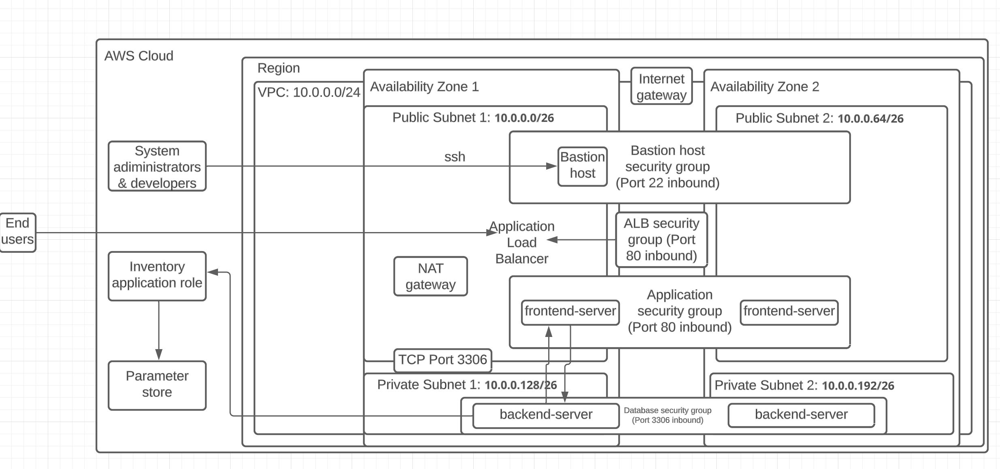
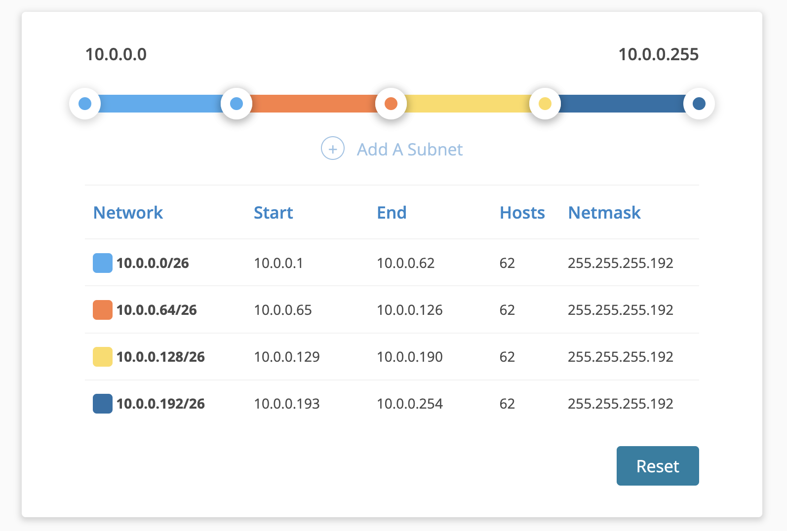

# PRJ_Cloud
### Efrei Paris M1 SE1 Students
-   Camille FOUR
-   Huiting FENG
Requirements: 
```
https://github.com/pascalito007/efrei-cloud-bigdata/tree/master/capstone-project
```


# I. App deployment
## 1-1. Architecture design diagram



From the above architecture on AWS, we can analyze those components as below:
1. AWS Cloud: we use the cloud environment provided by AWS and all our resources will host on this cloud environment.
2. 3 types of IAM role:
-   Inventory Application Role: can access to the Parameter Store and retrieve all necessary information linked to database.
-   End users: can link to Application Load Balancer, then go to navigate the web browser.
-   System administrators or developers: can use this only access to link to the Bastion Host, then can configure or manage other servers.
3. Parameter Store (AWS Systems Manager): where configuration data and sensitive information (database) are stored and can be retrieved by some specific role.
4. Region: AWS has different infrastructures in different region, and each region can have different isolated locations named as Availability Zones. We use 2 different availability zones, which can prevent that one server's crush in one availability zone cause the whole crush of application. In each availability zone, there are 2 frontend servers and 2 backend servers, but only one Bastion Host will be sufficient. Having only one Bastion Host can create a single controlled entry point to the network, and reduce the security issues while being monitoring by system administrators or developers.
5. VPC (10.0.0.0/24): our isolated network on AWS
-   Public Subnet 1 (10.0.0.0/26): a part of VPC's IPv4 address range in an availability zone, where some created EC2 instances can have direct access to the Internet. 
-   Public Subnet 2 (10.0.0.64/26): a part of VPC's IPv4 address range but in another availability zone
-   Private Subnet 1 (10.0.0.128/26): a part of VPC's IPv4 address range in an availability zone, where some created EC2 instances can not have direct access to the Internet, especially the database, because we need to secure it by preventing unallowed users from connecting directly to the database. 
-   Private Subnet 2 (10.0.0.192/26): a part of VPC's IPv4 address range but in another availability zone, where is the second database (EC2 instance).
6. Bastion Host: the only entry point to our AWS resources, which enables the access to an internal network from an external network (the internet). 
7. Application Load Balancer (ALB): helps link automatically the incoming traffic into different servers, and helps adjust resources to meet those traffic demands
8. frontend-server: server running the PHP application (in 2 different availability zones)
9. backend-server: server storing the database (in 2 different availability zones)
10. NAT gateway: allow resources in the private subnet to connect to the external internet but the external internet cannot directly access to the resources in the private subnet. This way can protect those resources in the private subnet (database). Also, it enables connect to other AWS services. For instance, the backend-server's (database) update can be downloaded by using NAT gateway.
11. Internet gateway: connect AWS resources with the external network.
12. TCP Port 3306: the standard TCP port that MySQL database servers can listen to. It should be configured while creating the security group.
13. 4 security groups (as virtual firewalls for instances to control inbound and outbound traffic): 
-   Bastion host security group (port 22 inbound): allow inbound SSH traffic (port 22) for remote operations made by System administrators or developers.
-   ALB security group (port 80 inbound): allow inbound HTTP traffic (port 80) from end users. However, we can add an inbound rule with the source as 0.0.0.0/0 for our application load balancer's security group, which enables to accept traffic from everyone in everywhere. This way won't enable to connect directly to other instances/servers, because the ALB will control traffic to target instances by following the created routing rules. Also, other settings about IAM roles and policies, security groups are also important.
-   Application security group (port 80 inbound): allow inbound HTTP traffic (port 80). When end users navigate to a website using a standard HTTP request, their browser is connecting to the server on port 80. End users firstly connect to ALB, then ALB's listener receives the connection requests from clients, then ALB forwards this request to frontend server (it's target instance) by following the configured routing rules. The connections between ALB and application are within Amazon VPC, the private network, and are not exposed directly to the public Internet. The frontend-server don't connect directly to the ALB, because it just waits to accept incoming connections from the ALB.
-   Database security group (port 3306 inbound): allow inbound MySQL traffic (port 3306) but only from the application server which is the authorized sources. Since the external internet won't connect to this database, the port 80 won't be added. Here, database connections are just from application servers, not from ALB or end users.


## 1-2. Steps of APP deployment on AWS
There are three versions while trying to deploy the APP and the final version is version 3 where the application is successfully deployed. The version 1 is our first try but a problem related to download MySQL was happened, so we cannot go further to deploy this application. The version 2 is a mix of 2 solutions, and one of the solution is following the above described architecture design. Whereas another problem is we are not familiar with the Application Loal Balancer and Auto Scaling Group etc, so this above solution was simplified by just using what we learned from the course, mainly by following the steps of challenge lab (creating a dynamic website for the Café). Since the version 2 combines a fail solution and a successful solution, a new version 3 is created to present all the final settings and the final demonstration. Below is the real final architecture design diagram used by us. The steps are general steps and all details can be seen from the folder of version3. 

### 1-2-1. Sign in AWS environment
1. Log in AWS account
2. Choose Paris as region (eu-west-3)

### 1-2-2. Create VPC and subnets 
1. Create a new VPC: (10.0.0.0/24)
2. Create two subnets (public and private): here 2 more subnets are created but not being used in the final version, and must ensure to enable the IPv4 addresses auto-sign for all subnets' configurations
3. Create one internet gateway and attach it to VPC
4. Create route tables including one public route table (linked to VPC and public subnet(s)) and two private route tables (linked to VPC)
5. Create 4 security groups (just created in version2 but not used in version3) and the final version3 creates a new security group for instance using Cloud9

### 1-2-3. Create Application Load Balancer and Auto Scaling group
Make some tries here by following the tutorial but failed and this step can be ignored because the final version is simplified without using ALB and Auto Scaling group.  


### 1-2-4. Create an EC2 instance
1. Create an instance using Cloud9
2. Choose t2.micro and configure details (VPC and public subnet)
3. Configure SG to allow SSH (port 22) from my IP (using in the version1 but not version2 & version3)
4. Configure SG to allow HTTP (port 80) and HTTPS(port 443)
5. Connect to it and open the Cloud9 IDE
6. Ready to write command lines to download the necessary packages and the PHP application and the SQL file

### 1-2-5. Setup RDS instance
1. Create database
2. Select MySQL, use Free Tier, specifier DB instance identifier (db) & master username (admin) & password (adminadmin)
3. Choose VPC & private subnet
4. Enable VPC SG and configure inbound rule to allow traffic from EC2 instance
6. Review everything and click "Create database"

### 1-2-6. Setup AWS Systems Manager Parameter Store and IAM roles
1. Go to Parameter Store
2. Create parameters with those given values (endpoint, database, password, username)
3. Go to IAM
4. Create two roles (Inventory_role + System_administrators_developers_role) 
5. Give some appropriate permissions to those roles

### 1-2-7. Install and configure the PHP application
1. SSH into the EC2 instance from my local machine (in version1) but do this step in Cloud9 IDE directly (in version2 and version3)
2. Use the given script to install packages & website files & SQL file
3. Move the PHP application to the Apache directory 
4. Import SQL file to the RDS instance and make some queries to fetch the data
5. (in the new browser tab) try to load the application by using the previous EC2 public IP address at http://<public-ip>
6. Test the application

### 1-2-8. Delete all used resources


## 1-3. Annexes
Subnet calculator:
```
https://community.spiceworks.com/tools/subnet-calc/ 
```
Architecture Design Diagram:
```
https://lucid.app/lucidchart/dd465d1c-c17d-462c-be25-6509db90d5b2/edit?viewport_loc=-760%2C-56%2C1755%2C1515%2C0_0&invitationId=inv_4d698b3f-0b6f-495f-82ed-dd17c315d030 
```
```
https://www.youtube.com/watch?v=OZuNZKdqdSk 
```
```
https://www.youtube.com/watch?v=aBgDXd_Brlw&ab_channel=DevOps%26CloudwithAryya 
```
```
https://www.youtube.com/watch?v=7e_mjVUV-zA&ab_channel=AMonkinCloud%E2%98%81%EF%B8%8F
```


# II. 10 Quiz
## 2-1. Iam Quiz
1. Which statement describes AWS Identity and Access Management (IAM) users ?

-   Option 1. IAM users are used to control access to a specific AWS resource
-   Option 2. IAM user names can represent a collection of individuals
-   Option 3. Every IAM user for an account must have a unique name
-   Option 4. Every IAM user name is unique across all AWS accounts
```    
Option 3
```

2. How can you grant the same level of permissions to multiple users within an account?

-   Option 1. Apply an AWS Identity and Access Management (IAM) policy to an IAM group
-   Option 2. Apply an AWS Identity and Access Management (IAM) policy to an IAM role
-   Option 3. Create a resource-based policy
-   Option 4. Create an organization in AWS Organizations
```
Option 1
```

3. Which statements describe AWS Identity and Access Management (IAM) roles? (Select TWO.)

-   Option 1. They are uniquely associated to an individual
-   Option 2. They can only be used by accounts associated to the person who creates the role
-   Option 3. They can be assumed by individuals, applications, and services
-   Option 4. They provide temporary security credentials
-   Option 5. They provide permanent security credentials
```
Option 3, Option 4
```

4. Which statement describes a resource-based policy

-   Option 1. It can be applied to any AWS resource
-   Option 2. It can be an AWS managed policy
-   Option 3. It is attached to a user or a group
-   Option 4. It is always an inline policy
```
Option 4
```

5. How does AWS Identity and Access Management (IAM) evaluate a policy?

-   Option 1. It checks for explicit allow statements before it checks for explicit deny statements
-   Option 2. It checks for explicit deny statements before it checks for explicit allow statements
-   Option 3. If there is no explicit deny statement or explicit allow statement, users will have access by default
-   Option 4. An explicit deny statement does not override an explicit allow statement
```
Option 2
```

6. A team of developers needs access to several services and resources in a virtual private cloud (VPC) for 9 months. How can you use AWS Identity and Access Management (IAM) to enable access for them?

-   Option 1. Create a single IAM user to the developer team and attach the required IAM policies
-   Option 2. Create an IAM user for each developer, and attach the required IAM policies to each IAM user
-   Option 3. Create an IAM user for each developer, put them all in an IAM group, and attach the required IAM policies to the IAM group
-   Option 4. Create a single IAM user for the developer team, place it in an IAM group, and attach the required IAM policies to the IAM group
```
Option 3
```

7. How does identity federation increase security for an application that it built in Amazon Web Services (AWS)?

-   Option 1. Users can use single sign-on (SSO) to access the application through an existing authenticated identity
-   Option 2. The application can synchronize user's user names and passwords in AWS identity and Access Management (IAM) with their social media accounts
-   Option 3. The browser can establish a trust relationship with the application to bypass the need for multi-factor authentication (MFA)
-   Option 4. Users can use their AWS Identity and Access Management (IAM) accounts to log in to on-premises systems
```
Option 1
```

## 2-2. Network Quiz
1. Which definition describes a virtual private cloud (VPC)?

-   Option 1. A virtual private network (VPN) in the AWS Cloud
-   Option 2. An extension of an on-premises network into Amazon Web Services (AWS)
-   Option 3. A logically isolated virtual network that you define in the AWS Cloud
-   Option 4. A fully managed service that extends the AWS Cloud to customer premises
```
Option 3
```

2. A company's VPC has the CIDR block 172.16.0.0/21 (2048 addresses). It has two subnets (A and B). Each subnet mush support 100 usable addresses now, but this number is expected to rise to at most 254 usable addresses soon. Which subnet addressing scheme meets the requirements and follows AWS best practices?

-   Option 1. Subnet A: 172.16.0.0/25 (128 addresses) Subnet B: 172.16.0.128/25 (1024 addresses)
-   Option 2. Subnet A: 172.16.0.0/25 (128 addresses) Subnet B: 172.16.0.128/25 (128 addresses)
-   Option 3. Subnet A: 172.16.0.0/23 (512 addresses) Subnet B: 172.16.0.128/23 (512 addresses)
-   Option 4. Subnet A: 172.16.0.0/22 (1024 addresses) Subnet B: 172.16.0.128/22 (128 addresses)
```
Option 2
```

3. Which combination of actions enables direct internet access for IPv4 hosts in a virtual private cloud (VPC)? (Select THREE.)

-   Option 1. Creating a route for 0.0.0.0/0 that points to the internet gateway
-   Option 2. Enabling Domain Name System (DNS) resolution for the VPC
-   Option 3. Configuring hosts to have or obtain an internet-routable address
-   Option 4. Configuring the VPC domain name in a Dynamic Host Configuration Protocol (DHCP) options set
-   Option 5. Creating a default route that points to the virtual private gateway
-   Option 6. Configuring security groups and network access control lists (network ACLs) to permit internet traffic
```
Option 1, Option 3, Option 6
```

4. Several EC2 instances launch in a virtual private cloud (VPC) that has internet access. These instances should not be accessible from the internet, but they must be able to download updates from the internet. How should the instances launch?

-   Option 1. With Elastic IP addresses, in a subnet with a default route to an internet gateway
-   Option 2. With public IP addresses, in a subnet with a default route to an internet gateway
-   Option 3. Without public IP addresses, in a subnet with a default route to an internet gateway
-   Option 4. Without public IP addresses, in a subnet with a default route to a network address translation (NAT) gateway
```
Option 4
```


# III. IAM
1. 
```{
  "Version": "2012-10-17",
  "Statement": [
    {
      "Sid": "AllowEC2AndS3",
      "Effect": "Allow",
      "Action": [
        "ec2:RunInstances",
        "ec2:TerminateInstances",
        "s3:GetObject",
        "s3:PutObject"
      ],
      "Resource": [
        "arn:aws:ec2:us-east-1:123456789012:instance/*",
        "arn:aws:s3:::example-bucket/*"
      ]
    }
  ]
}
```

Question: What actions are allowed for EC2 instances and S3 objects based on this policy? What specific resources are included?
-   Actions for EC2 instances:
    -   ec2: RunInstances - Enable to run instances
    -   ec2: TerminateInstances - Enable to terminate instances
-   Actions for S3 objects:
    -   s3: GetObject - Enable to get objects from S3
    -   s3: PutObject - Enable to put/upload objects to S3
-   Resources included for EC2 instances:
    -   arn:aws:ec2:us-east-1:123456789012:instance/* 
    (all EC2 instances in the "us-east-1" region and in the "123456789012" account)
-   Resources included for S3 objects:
    -   arn:aws:s3:::example-bucket/*
    (all S3 objects within the bucket named "example-bucket")

2. 
```
{
  "Version": "2012-10-17",
  "Statement": [
    {
      "Sid": "AllowVPCAccess",
      "Effect": "Allow",
      "Action": [
        "ec2:DescribeVpcs",
        "ec2:DescribeSubnets",
        "ec2:DescribeSecurityGroups"
      ],
      "Resource": "*",
      "Condition": {
        "StringEquals": {
          "aws:RequestedRegion": "us-west-2"
        }
      }
    }
  ]
}
```

Question: Under what condition does this policy allow access to VPC-related information? Which AWS region is specified?
-   This policy allows access to VPC-related information only when the requested region is "us-west-2". The requested region is the region where the client (who sends the request) wants the requests to be executed.

3. 
```
{
  "Version": "2012-10-17",
  "Statement": [
    {
      "Sid": "AllowS3ReadWrite",
      "Effect": "Allow",
      "Action": ["s3:GetObject", "s3:PutObject", "s3:ListBucket"],
      "Resource": [
        "arn:aws:s3:::example-bucket",
        "arn:aws:s3:::example-bucket/*"
      ],
      "Condition": {
        "StringLike": {
          "s3:prefix": ["documents/*", "images/*"]
        }
      }
    }
  ]
}
```

Question: What actions are allowed on the "example-bucket" and its objects based on this policy? What specific prefixes are specified in the condition?
-   Actions allowed on the "example-bucket" and the objects of "example-bucket":
    -   s3:GetObject - Enable to get objects from the "example-bucket" bucket
    -   s3:PutObject - Enable to put/upload objects to the "example-bucket" bucket
    -   s3:ListBucket - Enable to list/display the objects on the "example-bucket" bucket
-   Prefixes specified in the condition:
    -   documents/* (all objects having a prefix of "documents/" on the "example-bucket" bucket)
    -   images/* (all objects having a prefix of "images/" on the "example-bucket" bucket)

4. 
```
{
  "Version": "2012-10-17",
  "Statement": [
    {
      "Sid": "AllowIAMUserCreation",
      "Effect": "Allow",
      "Action": "iam:CreateUser",
      "Resource": "arn:aws:iam::123456789012:user/${aws:username}"
    },
    {
      "Sid": "AllowIAMUserDeletion",
      "Effect": "Allow",
      "Action": "iam:DeleteUser",
      "Resource": "arn:aws:iam::123456789012:user/${aws:username}"
    }
  ]
}
```

Question: What actions are allowed for IAM users based on this policy? How are the resource ARNs constructed?
-   Actions allowed:
    -   iam:CreateUser - Enable owner or related IAM users to create new IAM users
    -   iam:DeleteUser - Enable owner or related IAM users to delete IAM users
-   Resource ARNs constructed:
    -   arn:aws:iam::123456789012:user/${aws:username}
    -   ARN (Amazon Resource Name): a string to identify and access AWS resources with a specific format (arn:aws:<service>:<region>:<account>:<resource>)
    -   (Here) using the format: AWS account ID / the owner of resource (123456789012) + the username of the IAM user (${aws:username})
    -   the format without the specification of region, means this service IAM is global service

5. 
```
{
  "Version": "2012-10-17",
  "Statement": {
    "Effect": "Allow",
    "Action": ["iam:Get*", "iam:List*"],
    "Resource": "*"
  }
}
```

Questions:

-   Which AWS service does this policy grant you access to?
    -   AWS IAM (Identity and Access Management service)
-   Does it allow you to create an IAM user, group, policy, or role?
    -   No, it don't allow to create an IAM user, group, policy, or role, because the specified actions allowed are "iam:Get*" and "iam:List*". That means only get/read or list/display information from IAM. 
-   Go to https://docs.aws.amazon.com/IAM/latest/UserGuide/ and in the left navigation expand Reference > Policy Reference > Actions, Resources, and Condition Keys. Choose Identity And Access Management. Scroll to the Actions Defined by Identity And Access Management list.��Name at least three specific actions that the iam:Get* action allows.
    -   iam:GetSShPublicKey - Retrieve the specified SSH public key, including metadata about the key
    -   iam:GetUser - Retrieve information about the specified IAM user, including the user's creation date, path, unique ID, and ARN
    -   iam:GetUserPolicy - Retrieve the specified inline policy document that is embedded in the specified IAM user
```
https://docs.aws.amazon.com/IAM/latest/APIReference/API_Operations.html
```

6. 
```
{
  "Version": "2012-10-17",
  "Statement": [
    {
      "Condition": {
        "StringEquals": {
          "ec2:InstanceType": ["t2.micro", "t2.small"]
        }
      },
      "Resource": "arn:aws:ec2:*:*:instance/*",
      "Action": ["ec2:RunInstances", "ec2:StartInstances"],
      "Effect": "Deny"
    }
  ]
}
```

Questions:

-   What actions does the policy allow?
    -   The policy don't allow user or role to do anything, because AWS's default behavior is to deny, all actions should be denied. Here, this policy denies explicitly two actions: "ec2:RunInstances" and "ec2:StartInstances". If there is only this statement in this policy, all actions are denied. Whereas, if there are other statements with actions allowed, those actions are then allowed by this policy.
-   Say that the policy included an additional statement object, like this example:
```
{
  "Effect": "Allow",
  "Action": "ec2:*"
}
```

-   How would the policy restrict the access granted to you by this additional statement?
    -   Here, with a new added statement object into the IAM policy, all EC2 actions are allowed, because this statement means exactly allowing all actions for all types of EC2 instances. However, "deny" policies always override "allow" policies. Even though this additional statement allows all actions for all types of EC2 instances, those two actions ("ec2:RunInstances" and "ec2:StartInstances") are not allowed on two types of EC2 instances ("t2.micro" and "t2.small"). Thus, this policy with two statements will allow all actions on all EC2 instances except for running new instance or for starting instance ("t2.micro" and "t2.small"). 
-   If the policy included both the statement on the left and the statement in question 2, could you terminate an m3.xlarge instance that existed in the account?
    -   "m3.xlarge" instance is a type of EC2 instance, so we can terminate an "m3.xlarge" instance that existed in the account. These two statements on the policy allow all actions on all EC2 instances except for running new instance or for starting instance ("t2.micro" and "t2.small"). "m3.xlarge" instance then is allowed for all actions, so we can terminate this type of instance.


# IV. AWS Quicksight 

## 4-1. Screenshots
Check the above folder related to the AWS Quicksight

## 4-2. Annexes
```
https://www.youtube.com/watch?v=MZGloAruLGQ&ab_channel=DataDoozers
```
```
https://www.youtube.com/watch?v=yDfFBRjHFs0&ab_channel=AmazonQuickSight
```

